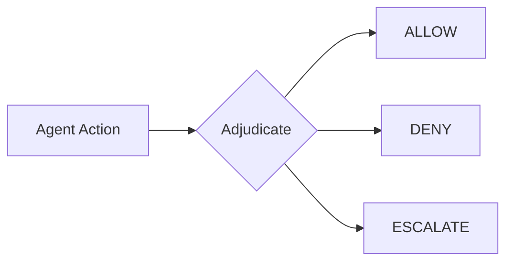

# Decisions

At each [stage](stages.md) in the agent loop, the harness evaluates your policies and returns a decision: **ALLOW**, **DENY**, or **ESCALATE**. This process is called **adjudication**. Every time your agent is about to call a model, execute a tool, or return output, you call `harness.adjudicate()` and act on the result.

How you handle decisions determines whether your agent fails or adapts. When the harness denies an action, it both blocks and tells the agent **why**. Feed that reason back to the model, and it can try a different approach. This is **steering**, and it's what makes agents more reliable.

---

## ALLOW, DENY, and ESCALATE

Every adjudication returns one of three decisions:



| Decision     | What happens                     | When to use                                              |
| :----------- | :------------------------------- | :------------------------------------------------------- |
| **ALLOW**    | Action proceeds                  | Actions that match a `permit` policy                     |
| **DENY**     | Action blocked, reason returned  | Policy violations, unsafe actions, out-of-scope requests |
| **ESCALATE** | Action paused, requires approval | High-risk actions that need approval before proceeding   |

### How ESCALATE Works

ESCALATE is triggered by the `@escalate` annotation on `forbid` policies. When a forbid policy with `@escalate` matches, instead of returning DENY, the harness returns ESCALATE, which signals that the action needs external approval before proceeding.

```cedar
// Hard deny: always blocks, no escalated approval possible
@id("block-dangerous-commands")
forbid(principal, action == MyAgent::Action::"Bash", resource)
when { context.parameters_json like "*rm -rf*" };

// Soft deny with escalation: can proceed after approval
@id("high-value-transfer")
@escalate("finance-team")
@reason("Transfers over $10,000 require approval")
forbid(principal, action == MyAgent::Action::"Transfer", resource)
when { context.parameters.amount > 10000 };
```

**Key rules:**

- `@escalate` is only valid on `forbid` policies (not `permit`)
- If ANY `forbid` policy without `@escalate` matches, then the decision is **DENY** (hard deny always wins)
- If the only matching `forbid` policies all have an `@escalate` annotation, then the decision is **ESCALATE**
- The `@escalate` annotation can take an optional argument (e.g., `@escalate("finance-team")`) to provide metadata as part of the adjudication, like where to route approvals

This means you can have both hard denials and soft denials in the same policy set. Hard denials block unconditionally; soft denials escalate for approval.

---

## Steering

Traditional guardrails just block. The agent hits a wall, gets an error, and either retries the same thing or gives up. Steering is different: the harness returns the denial reason, and you feed it back to the model so it can course-correct.

### Policy + Code

First, define a policy that blocks dangerous commands:

```cedar
// Allow all actions by default
permit(principal, action, resource);

// Block the Bash tool when command contains "rm -rf"
@id("no-rm-rf")
forbid(principal, action == MyAgent::Action::"Bash", resource)
when { context has parameters_json && context.parameters_json like "*rm -rf*" };
```

Then adjudicate before executing:

```{.python notest}
from sondera import Stage, Role, Decision, ToolRequestContent

# Adjudicate a tool call before executing it
result = await harness.adjudicate(
    Stage.PRE_TOOL,                    # Check before tool execution
    Role.MODEL,                        # The model is requesting this action
    ToolRequestContent(tool_id="Bash", args={"command": "rm -rf /"})
)

if result.decision == Decision.DENY:
    # result.reason is a human-readable explanation
    # result.policies contains metadata about the policies that matched
    agent_feedback = f"Action denied: {result.reason}. Try a different approach."
```

**Without steering:** Agent tries `rm -rf /` → gets error → retries same thing → loops forever

**With steering via `result.reason`:** Agent tries `rm -rf /` → learns "dangerous patterns forbidden" → tries `rm ./temp/cache.txt` instead

This is what makes it safe to run agents longer with more autonomy. Instead of failing on the first policy violation, agents learn the boundaries and work within them.

---

## Handling Decisions

After each adjudication, your code decides what to do next. In a custom agent, this logic lives in your agent loop. If you're using a framework integration, the middleware handles ALLOW and DENY for you. We don't yet handle ESCALATE in the framework integrations automatically, so you'll need custom handling for the time being.

```{.python notest}
from sondera import Stage, Role, Decision, PolicyViolationError

# Adjudicate returns an Adjudication with the decision
result = await harness.adjudicate(stage, role, content)

if result.decision == Decision.ALLOW:
    # Policy permits this action, proceed
    execute_action()  # Your logic here

elif result.decision == Decision.DENY:
    # Policy forbids this action
    # Option A: Block entirely
    raise PolicyViolationError(stage, result.reason, result)

    # Option B: Steer the agent (comment out the raise above to use this)
    # return f"Action denied: {result.reason}. Try a different approach."

elif result.decision == Decision.ESCALATE:
    # Action requires approval before proceeding. Use policy metadata
    # to route the approval request.
    policy = result.policies[0]
    # Assuming you have a `request_approval` function implemented:
    approved = await request_approval(
        action=content,
        reason=policy.description,
        route_to=policy.escalate_arg,  # e.g., "finance-team"
    )
    if approved:
        execute_action()
    else:
        raise PolicyViolationError(stage, "Escalation rejected", result)
```

!!! note "Framework Integration Support"
    The LangGraph, ADK, and Strands integrations currently handle ALLOW and DENY decisions. For ESCALATE workflows, use the [custom integration](../integrations/custom.md) pattern to implement your own approval logic.

### When to Block vs. Steer vs. Escalate

Choose based on the action and your risk tolerance:

| Strategy     | Behavior                         | Use when                                                    |
| :----------- | :------------------------------- | :---------------------------------------------------------- |
| **Block**    | Stop execution immediately       | Security-critical actions, compliance requirements, testing |
| **Steer**    | Return reason, let agent retry   | Agent can find alternatives, building autonomous systems    |
| **Escalate** | Pause and request approval       | High-risk actions where a human or system should decide     |

You can combine all three: block on security violations, escalate high-value operations, steer on everything else.

---

## Decision Properties

The `Adjudication` result gives you everything you need to act on the decision: the decision type, the reason behind it, and any metadata from matching policies.

```{.python notest}
result = await harness.adjudicate(stage, role, content)

# The decision enum value
result.decision  # Decision.ALLOW, Decision.DENY, or Decision.ESCALATE

# Human-readable explanation
result.reason    # e.g., "Denied by policies"

# Policies that determined this decision (list of PolicyMetadata)
result.policies  # e.g., [PolicyMetadata(id="spending-limit", ...), ...]
```

### Accessing Policy Metadata from Cedar Annotations

Sometimes you need more than just the decision. Cedar annotations let policy authors attach custom metadata to a policy: severity levels, audit tags, escalation routing, data you need for logging and alerting, etc. For each policy that contributed to a decision, this metadata can be accessed via a corresponding `PolicyMetadata` object.

```{.python notest}
# Policies that determined this decision
result.policies  # List of PolicyMetadata objects

# Each policy has: id, description, escalation info, and custom metadata dict
for policy in result.policies:
    print(policy.id)           # Policy ID that matched
    print(policy.description)  # Human-readable description (from @reason)
    print(policy.escalate)     # True if this policy has @escalate
    print(policy.escalate_arg) # The @escalate argument, e.g., "finance-team"
    print(policy.custom)       # {"severity": "critical", ...}

    if policy.escalate:
        # Escalate to the team specified in policy.escalate_arg.
        # E.g., assuming you have a request_approval function:
        await request_approval(route_to=policy.escalate_arg)

    # Use custom metadata for your own logic
    if policy.custom.get("severity") == "critical":
        alert_security_team(result)  # Your alerting logic here
```

Policy metadata is defined in your Cedar policies using the `@` syntax. See [Writing Policies](../writing-policies.md) for details.

---

## Next Steps

- [**Policies**](policies.md): How decisions are defined with policy-as-code
- [**Stages**](stages.md): Where decisions happen in the agent loop
- [**Trajectories**](trajectories.md): How decisions are recorded
