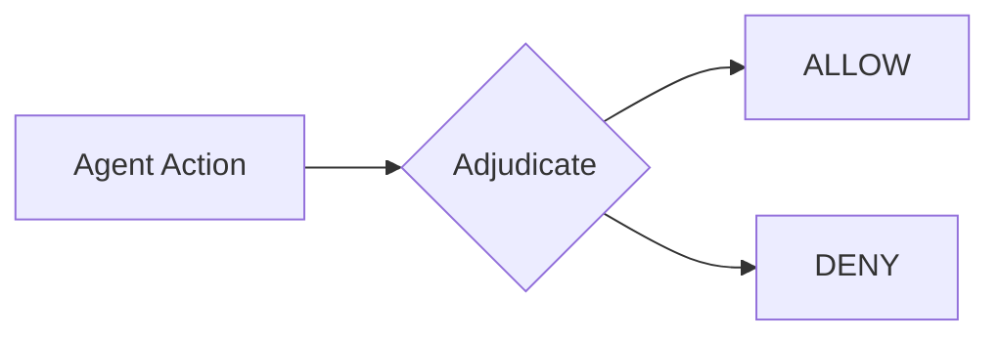

# Decisions

At each [stage](stages.md) in the agent loop, the harness evaluates your policies and returns a decision: **ALLOW** or **DENY**. This process is called **adjudication**. Every time your agent is about to call a model, execute a tool, or return output, you call `harness.adjudicate()` and act on the result.

How you handle decisions determines whether your agent fails or adapts. When the harness denies an action, it both blocks and tells the agent **why**. Feed that reason back to the model, and it can try a different approach. This is **steering**, and it's what makes agents more reliable.

---

## ALLOW and DENY

Every adjudication returns one of two decisions:



| Decision  | What happens                    | When to use                                              |
| :-------- | :------------------------------ | :------------------------------------------------------- |
| **ALLOW** | Action proceeds                 | Actions that match a `permit` policy                     |
| **DENY**  | Action blocked, reason returned | Policy violations, unsafe actions, out-of-scope requests |

---

## Steering

Traditional guardrails just block. The agent hits a wall, gets an error, and either retries the same thing or gives up. Steering is different: the harness returns the denial reason, and you feed it back to the model so it can course-correct.

### Policy + Code

First, define a policy that blocks dangerous commands:

```cedar
// Allow all actions by default
permit(principal, action, resource);

// Block the Bash tool when command contains "rm -rf"
@id("no-rm-rf")
forbid(principal, action == MyAgent::Action::"Bash", resource)
when { context has parameters_json && context.parameters_json like "*rm -rf*" };
```

Then adjudicate before executing:

```{.python notest}
from sondera import Stage, Role, ToolRequestContent

# Adjudicate a tool call before executing it
result = await harness.adjudicate(
    Stage.PRE_TOOL,                    # Check before tool execution
    Role.MODEL,                        # The model is requesting this action
    ToolRequestContent(tool_id="Bash", args={"command": "rm -rf /"})
)

if result.is_denied:
    # result.reason contains the policy ID and explanation
    # e.g., "block-dangerous-bash: command matches forbidden pattern"
    agent_feedback = f"Action denied: {result.reason}. Try a different approach."
```

**Without steering:** Agent tries `rm -rf /` → gets error → retries same thing → loops forever

**With steering via `result.reason`:** Agent tries `rm -rf /` → learns "dangerous patterns forbidden" → tries `rm ./temp/cache.txt` instead

This is what makes it safe to run agents longer with more autonomy. Instead of failing on the first policy violation, agents learn the boundaries and work within them.

---

## Handling Decisions

After each adjudication, your code decides what to do next. In a custom agent, this logic lives in your main loop. If you're using a framework integration, the middleware handles it for you. Either way, the pattern is the same:

```{.python notest}
from sondera import Stage, Role, PolicyViolationError

# Adjudicate returns an Adjudication with the decision
result = await harness.adjudicate(stage, role, content)

if result.is_allowed:
    # Policy permits this action, proceed
    execute_action()  # Your logic here

elif result.is_denied:
    # Policy forbids this action
    # Option A: Block entirely
    raise PolicyViolationError(stage, result.reason, result)

    # Option B: Steer the agent (comment out the raise above to use this)
    # return f"Action denied: {result.reason}. Try a different approach."
```

### When to Block vs Steer

Choose based on the action and your risk tolerance:

| Strategy  | Behavior                       | Use when                                                    |
| :-------- | :----------------------------- | :---------------------------------------------------------- |
| **Block** | Stop execution immediately     | Security-critical actions, compliance requirements, testing |
| **Steer** | Return reason, let agent retry | Agent can find alternatives, building autonomous systems    |

You can use both: block on security violations, steer on everything else.

---

## Decision Properties

The `Adjudication` result gives you everything you need to act on the decision: the decision type, the reason behind it, and any metadata from matching policies.

```{.python notest}
result = await harness.adjudicate(stage, role, content)

# Boolean helpers for conditional logic
result.is_allowed    # True if decision is ALLOW
result.is_denied     # True if decision is DENY

# Raw enum value (useful for logging or switch statements)
result.decision      # Decision.ALLOW or Decision.DENY

# Human-readable explanation (always present for DENY)
result.reason        # e.g., "spending-limit: amount exceeds $10,000 threshold"
```

### Annotations

Sometimes you need more than just the decision. Annotations let policies attach custom metadata: severity levels, audit tags, or data you need for logging and alerting.

```{.python notest}
# Annotations come from matching policies
result.annotations  # List of PolicyAnnotation objects

# Each annotation has: id, description, and custom metadata dict
for annotation in result.annotations:
    print(annotation.id)           # Policy ID that matched
    print(annotation.description)  # Human-readable description
    print(annotation.custom)       # {"severity": "critical", ...}

    # Use custom metadata for your own logic
    if annotation.custom.get("severity") == "critical":
        alert_security_team(result)  # Your alerting logic here
```

Annotations are defined in your Cedar policies using the `@` syntax. See [Writing Policies](../writing-policies.md) for details.

---

## Next Steps

- [**Policies**](policies.md): How decisions are defined with policy-as-code
- [**Stages**](stages.md): Where decisions happen in the agent loop
- [**Trajectories**](trajectories.md): How decisions are recorded
