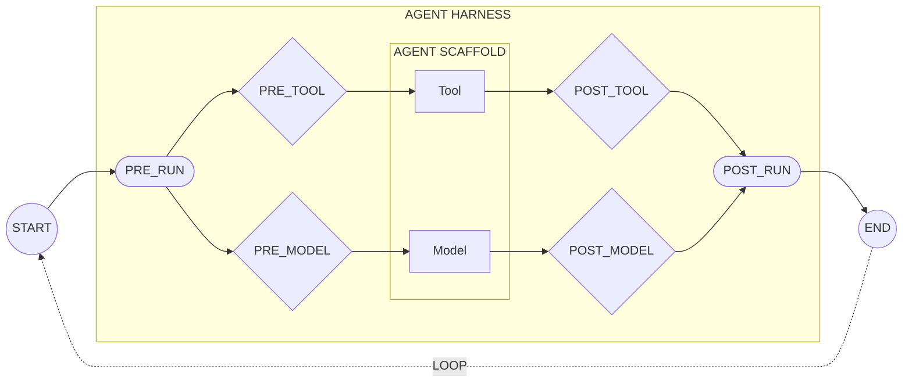

# Core Concepts

Agents operate in a loop: receive input, call a model, execute tools, return output. This loop runs autonomously, which is powerful until the agent does something unexpected. The harness lets you steer agent behavior by intercepting actions at key points and evaluating them against your policies. This gives you better control, improved reliability, stronger security, and compliance when you need it.

---

## The Agent Loop

Every agent framework implements some version of this loop:

The **agent scaffold** is your agent framework or coding assistant: LangGraph, Google ADK, Strands, Claude Code, Cursor, or custom code. It orchestrates the model and tools. You can hardcode rules inside the scaffold, but it's tedious: every agent needs different logic for every tool, and updates mean changing code everywhere. Worse, controls inside the scaffold can be bypassed by prompt injection or emergent behavior.

The **agent harness** wraps the scaffold from the outside. It lets you define policies once and enforce them across all your agents. Updates happen in one place. And because the harness sits outside the scaffold, it can't be bypassed by the agent itself. The harness intercepts at six [stages](stages.md):

1. **PRE_RUN**: Agent receives a task and starts execution
2. **PRE_MODEL / POST_MODEL**: Agent calls the LLM and gets a response
3. **PRE_TOOL / POST_TOOL**: Agent executes tools (APIs, MCP servers, file access, code execution)
4. **POST_RUN**: Agent completes and returns results

Each pass through the loop is a **turn**. The agent repeats turns until the task is complete. All turns together form a [**trajectory**](trajectories.md): the complete record of an agent's execution.

[Policies](policies.md) are rules written in [Cedar](https://www.cedarpolicy.com/), a language designed for authorization logic. When a decision is DENY, you choose how to handle it: **block** the agent entirely, or **steer** it by returning the reason so it can try a different approach. For actions that need approval, use the `@escalate` annotation on forbid policies to trigger an **escalate** decision. See [Writing Policies](../writing-policies.md) for Cedar syntax, or [Escalation with @escalate](../writing-policies.md#escalation-with-escalate) for approval patterns.

---

## Concepts

| Concept                             | What it is                              | Why it matters                                                                                    |
| :---------------------------------- | :-------------------------------------- | :------------------------------------------------------------------------------------------------ |
| [**Decisions**](decisions.md)       | ALLOW, DENY, or ESCALATE                | Steer agents toward better behavior. Let them self-correct instead of just failing.               |
| [**Policies**](policies.md)         | Rules that define agent behavior        | Define guardrails once, enforce everywhere. Can't be bypassed by prompt injection.                |
| [**Stages**](stages.md)             | The six interception points in the loop | Target policies precisely. Catch mistakes at the right moment without disrupting the whole agent. |
| [**Trajectories**](trajectories.md) | Immutable records of every step         | Debug failures, improve reliability over time, prove compliance when you need it.                 |
