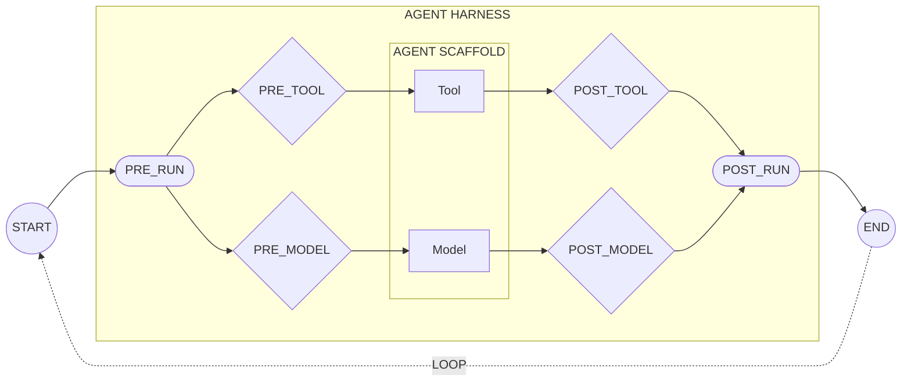

# Stages

The harness intercepts at six stages in the agent execution loop. Each stage represents a point where you can evaluate and steer agent behavior. By targeting specific stages, you can write precise policies: catch mistakes at the right moment, guide the agent toward better approaches, and enforce security or compliance rules only where they matter.

---

## The Agent Loop

Agents work in cycles: think, act, observe, repeat. The model decides what to do, tools execute actions, and results feed back to the model. The harness wraps this loop and intercepts at each transition, letting you evaluate policies before and after each step.

The diagram below shows the **agent scaffold** (your agent framework or coding assistant: LangGraph, ADK, Strands, Claude Code, Cursor, or custom code) wrapped by the **agent harness**. The harness intercepts at six stages. Within each turn, the model may call zero or more tools before completing.



The loop continues until the model decides to stop (no more tool calls) or a policy denies an action.

---

## Stage Reference

| Stage | When | Common Uses                                                            |
|:------|:-----|:-----------------------------------------------------------------------|
| `PRE_RUN` | Before agent starts | Session initialization, user authentication                            |
| `PRE_MODEL` | Before LLM call | Input validation, prompt injection defense                             |
| `POST_MODEL` | After LLM response | Output filtering, intent verification                                  |
| `PRE_TOOL` | Before tool execution | Argument checks, business logic verification, sensitive data filtering |
| `POST_TOOL` | After tool execution | Result sanitization, prompt injection defense                          |
| `POST_RUN` | After agent completes | Trajectory finalization, audit logging                                 |

---

## Choosing a Stage

**PRE stages** let you block or modify before something happens. **POST stages** let you inspect and filter after.

| If you want to... | Use this stage |
|:------------------|:---------------|
| Block dangerous tool arguments | `PRE_TOOL` |
| Filter sensitive data from tool results | `POST_TOOL` |
| Catch prompt injection in user input | `PRE_MODEL` |
| Prevent the model from leaking secrets | `POST_MODEL` |
| Check user authentication at session start | `PRE_RUN` |
| Log the final trajectory | `POST_RUN` |

**PRE_TOOL is the most common stage.** Most policies check tool arguments before execution: spending limits, path restrictions, command filtering. If you're not sure where to start, start there.

---

## Stage Examples

### PRE_RUN / POST_RUN: Session Lifecycle

Initialize and finalize agent sessions. These stages are typically used for session setup, authentication checks, and audit logging rather than content-based policy enforcement.

```{.python notest}
from sondera import Stage, Role, PromptContent

# Before agent starts: create trajectory and check session policies
await harness.initialize(agent=agent)
result = await harness.adjudicate(
    Stage.PRE_RUN,
    Role.SYSTEM,  # SYSTEM role for lifecycle events
    PromptContent(text=f"Session started for user {user_id}")
)

# ... agent execution loop ...

# After agent completes: check final policies and close trajectory
result = await harness.adjudicate(
    Stage.POST_RUN,
    Role.SYSTEM,
    PromptContent(text="Session complete")
)
await harness.finalize()  # Marks trajectory as complete
```

**Common policies:**

```cedar
// Limit how many steps an agent can take in one session
@id("limit-session-length")
forbid(principal, action, resource)
when { resource.step_count > 100 };  // resource.step_count is always available
```

---

### PRE_MODEL: Input Validation

Block prompt injection attempts before they reach the LLM:

```{.python notest}
from sondera import Stage, Role, Decision, PromptContent

# Check user input before sending to the model
result = await harness.adjudicate(
    Stage.PRE_MODEL,
    Role.USER,  # USER role because this is user-provided input
    PromptContent(text=user_input)
)

if result.decision == Decision.DENY:
    # Don't send to model; return error to user
    print(f"Input blocked: {result.reason}")
else:
    # Safe to proceed with LLM call
    pass
```

**Common policies:**

```cedar
// Block common prompt injection patterns in user input
@id("block-jailbreak-attempts")
forbid(principal, action, resource)
when {
  resource has content &&  // Message text is stored on the resource entity
  (resource.content like "*ignore previous instructions*" ||
   resource.content like "*disregard your rules*")
};
```

---

### POST_MODEL: Output Filtering

Filter model output before it reaches the user:

```{.python notest}
from sondera import Stage, Role, Decision, PromptContent

# Check model output before returning to user
result = await harness.adjudicate(
    Stage.POST_MODEL,
    Role.MODEL,  # MODEL role because this is LLM-generated output
    PromptContent(text=model_response)
)

if result.decision == Decision.DENY:
    # Model generated inappropriate content; substitute safe response
    response = "I can't provide that information."
else:
    # Safe to return model_response to user
    response = model_response
```

**Common policies:**

```cedar
// Prevent model from leaking sensitive information
@id("block-sensitive-output")
forbid(principal, action, resource)
when {
  resource has content &&  // Model output is stored on the resource entity
  (resource.content like "*internal API key*" ||
   resource.content like "*password:*")
};
```

---

### PRE_TOOL: Argument Validation

Check tool arguments before execution. The role is `MODEL` because the model is requesting the tool call.

```{.python notest}
from sondera import Stage, Role, Decision, ToolRequestContent

# Check tool arguments before execution
result = await harness.adjudicate(
    Stage.PRE_TOOL,
    Role.MODEL,  # Always MODEL at PRE_TOOL (model is requesting the call)
    ToolRequestContent(tool_id="Transfer", args={"amount": 50000})
)

if result.decision == Decision.DENY:
    # Tool does NOT execute. Return reason to model so it can adjust.
    print(f"Transfer blocked: {result.reason}")
else:
    # Safe to execute the tool
    execute_transfer(amount=50000)
```

When a PRE_TOOL policy denies, the tool doesn't execute. You can return `result.reason` to the model so it can try a different approach (this is called **steering**).

**Common policies:**

```cedar
// Limit transfer amounts to $10,000
// Uses typed parameters (requires tool.parameters_json_schema)
@id("spending-limit")
forbid(principal, action == MyAgent::Action::"Transfer", resource)
when {
  context has parameters &&           // Check context.parameters exists
  context.parameters has amount &&    // Check amount field exists
  context.parameters.amount > 10000
};

// Block writes to system directories using pattern matching
// For simpler matching without typed schema, use: context.parameters_json like "*path*"
@id("block-dangerous-paths")
forbid(principal, action == MyAgent::Action::"FileWrite", resource)
when {
  context has parameters &&
  context.parameters has path &&
  context.parameters.path like "/etc/*"  // Wildcard pattern matching
};
```

---

### POST_TOOL: Result Sanitization

Sanitize tool results before returning to the model:

```{.python notest}
from sondera import Stage, Role, Decision, ToolResponseContent

# Check tool result before returning to model
result = await harness.adjudicate(
    Stage.POST_TOOL,
    Role.TOOL,  # Always TOOL at POST_TOOL (tool has returned a result)
    ToolResponseContent(tool_id="Database", response=query_result)
)

if result.decision == Decision.DENY:
    # Result contained sensitive data; sanitize before returning to model
    sanitized_result = redact_pii(query_result)
else:
    # Safe to return query_result to model
    sanitized_result = query_result
```

**Common policies:**

```cedar
// Block tool results containing PII before they reach the model
@id("block-pii-in-results")
forbid(principal, action, resource)
when {
  context has response_json &&  // Tool results are JSON-serialized in context.response_json
  (context.response_json like "*SSN:*" ||
   context.response_json like "*credit card*")
};
```

---

## Content Types

Each stage evaluates a specific type of content:

| Type                    | Used at stage | Description               |
| :---------------------- | :------------ | :------------------------ |
| **PromptContent**       | PRE_MODEL, POST_MODEL, PRE_RUN, POST_RUN | Text messages |
| **ToolRequestContent**  | PRE_TOOL | Tool calls with arguments |
| **ToolResponseContent** | POST_TOOL | Results from tools |

```python
from sondera import PromptContent, ToolRequestContent, ToolResponseContent

# Text message (PRE_MODEL, POST_MODEL)
prompt = PromptContent(text="What's the weather?")

# Tool call (PRE_TOOL)
request = ToolRequestContent(tool_id="weather", args={"location": "SF"})

# Tool result (POST_TOOL)
response = ToolResponseContent(tool_id="weather", response={"temp": 72})
```

---

## Roles

Content is attributed to one of four roles:

| Role     | Description                      | Common stage |
| :------- | :------------------------------- | :----------- |
| `USER`   | Input from the end user          | PRE_MODEL |
| `MODEL`  | Output from the LLM              | POST_MODEL, PRE_TOOL |
| `TOOL`   | Output from tool execution       | POST_TOOL |
| `SYSTEM` | System-level messages            | PRE_RUN, POST_RUN |

---

## Framework Integration

When using framework integrations, stages map to framework callbacks. Integrations for Claude Code and Cursor are coming soon.

| Stage | LangGraph | Google ADK | Strands |
|:------|:----------|:-----------|:--------|
| `PRE_RUN` | `on_start` | `on_before_agent` | `on_start` |
| `PRE_MODEL` | `before_model` | `on_before_model` | `on_model_request` |
| `POST_MODEL` | `after_model` | `on_after_model` | `on_model_response` |
| `PRE_TOOL` | `before_tool` | `on_before_tool` | `on_tool_request` |
| `POST_TOOL` | `after_tool` | `on_after_tool` | `on_tool_response` |
| `POST_RUN` | `on_end` | `on_after_agent` | `on_end` |

---

## Next Steps

- [**Trajectories**](trajectories.md): How every stage transition is recorded
- [**Policies**](policies.md): Target specific stages in your policies
- [**Writing Policies**](../writing-policies.md): Complete guide to Cedar syntax and patterns
