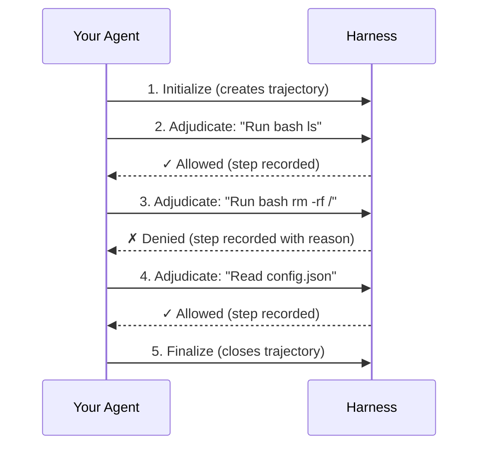

# Trajectories

A trajectory is a complete, immutable record of an agent execution. It captures every input, output, tool call, and policy decision. Trajectories are how you debug agent failures, improve reliability over time, and prove compliance when you need it.

---

## What Trajectories Capture

- :material-inbox-arrow-down: **Every input** the agent received
- :material-inbox-arrow-up: **Every output** the agent produced
- :material-tools: **Every tool call** and its arguments
- :material-gavel: **Every policy decision** and why it was made

---

## Trajectory Lifecycle

Every trajectory follows the same lifecycle: initialize, adjudicate, finalize.



Each adjudication creates a **step** in the trajectory. Steps occur at different **stages** of the agent loop (PRE_MODEL, POST_MODEL, PRE_TOOL, POST_TOOL). Even denied actions are recorded for auditing.

### Harness Methods

Three methods control the lifecycle: `initialize()`, `adjudicate()`, and `finalize()`.

```{.python notest}
from sondera import Stage, Role, ToolRequestContent, PolicyViolationError

# Assume harness and agent are already configured (see Getting Started)

# 1. Initialize: creates a new trajectory
await harness.initialize(agent=agent)
trajectory_id = harness.trajectory_id  # Store this for later retrieval

# 2. Adjudicate: each call adds a step to the trajectory
result = await harness.adjudicate(
    Stage.PRE_TOOL, Role.MODEL,
    ToolRequestContent(tool_id="Bash", args={"command": "ls"})
)

if result.is_denied:
    # The step is still recorded. Your code decides what to do next.
    # Option A: Stop execution
    raise PolicyViolationError(Stage.PRE_TOOL, result.reason, result)
    # Option B: Steer the agent (feed reason back to model)
    # return f"Action denied: {result.reason}. Try a different approach."

# 3. Finalize: marks trajectory as complete
await harness.finalize()
```

**When a step is denied:** The harness returns `Decision.DENY` but doesn't stop your agent automatically. Your agent code decides what to do: skip the action, try an alternative, or halt execution. The denied step is still recorded in the trajectory for auditing. See [Decisions](decisions.md) for handling patterns.

---

## Real-World Example: Debugging a Failure

Here's a typical workflow: your agent failed in production, and you need to figure out why.

```{.python notest}
from datetime import datetime, timedelta
from sondera import SonderaRemoteHarness, TrajectoryStatus

harness = SonderaRemoteHarness()

# 1. Find recent failed trajectories
cutoff_time = datetime.now(timezone.utc) - timedelta(hours=24)
all_failed = await harness.list_trajectories(
    agent_id="customer-support-agent",
    status=TrajectoryStatus.FAILED,
)

# Filter client-side by created_at
failed = [t for t in all_failed if t.created_at >= cutoff_time]

print(f"Found {len(failed)} failed trajectories in the last 24 hours")

# 2. Get full details for the most recent failure
if failed:
    trajectory = await harness.get_trajectory(failed[0].id)

    # 3. Find what went wrong
    for adj_step in trajectory.steps:
        if adj_step.is_denied:
            print(f"DENIED at {adj_step.step.stage.value}:")
            print(f"  Action: {adj_step.step.content}")
            print(f"  Reason: {adj_step.adjudication.reason}")

    # 4. Check metadata for context
    print(f"User: {trajectory.metadata.get('user_id')}")
    print(f"Session: {trajectory.metadata.get('session_id')}")
    print(f"Duration: {trajectory.duration}s")
```

---

## Trajectory Types

Sondera uses two trajectory types. The difference is whether steps include adjudication details:

| Type | Steps contain | When to use |
|:-----|:--------------|:------------|
| `Trajectory` | `TrajectoryStep` | Listing and filtering (lightweight, no policy details) |
| `AdjudicatedTrajectory` | `AdjudicatedStep` | Debugging and auditing (full policy decisions) |

**Why two types?** Performance. When listing hundreds of trajectories, you don't need full adjudication details for each step. Use `list_trajectories()` to browse (returns `Trajectory`), then `get_trajectory(id)` to fetch full details for a specific one (returns `AdjudicatedTrajectory`).

### Trajectory

Basic trajectory metadata, returned by `list_trajectories()`:

```{.python notest}
from sondera import Trajectory, TrajectoryStatus

traj: Trajectory
traj.id           # Unique identifier (e.g., "traj-abc123")
traj.agent_id     # Agent that executed
traj.status       # TrajectoryStatus enum (see below)
traj.created_at   # When trajectory was created
traj.updated_at   # When trajectory was last updated
traj.started_at   # When execution started (after first step)
traj.ended_at     # When execution finished (after finalize)
traj.metadata     # Custom metadata dict (see Metadata section)
traj.steps        # list[TrajectoryStep] - steps WITHOUT adjudication

# Convenience properties
traj.step_count   # Number of steps
traj.duration     # Seconds between started_at and ended_at (or None)
traj.is_completed # True if status is COMPLETED or FAILED
traj.is_active    # True if status is RUNNING

# Filter methods
traj.get_steps_by_role(Role.MODEL)       # All model steps
traj.get_steps_by_stage(Stage.PRE_TOOL)  # All PRE_TOOL steps
```

### AdjudicatedTrajectory

Full trajectory with policy decisions on each step, returned by `get_trajectory()`:

```{.python notest}
from sondera import AdjudicatedTrajectory

adj_traj: AdjudicatedTrajectory
adj_traj.steps   # list[AdjudicatedStep] - steps WITH adjudication
# All other properties same as Trajectory
```

### TrajectoryStep

A raw step without adjudication info:

```{.python notest}
from sondera import TrajectoryStep

step: TrajectoryStep
step.stage       # Stage enum: PRE_MODEL, PRE_TOOL, etc.
step.role        # Role enum: USER, MODEL, TOOL, SYSTEM
step.content     # ToolRequestContent, ToolResponseContent, or PromptContent
step.created_at  # When this step occurred
step.state       # Optional dict: agent state at this point (see State section)
step.context     # Optional dict: request context (see Context section)
```

### AdjudicatedStep

A step paired with its policy decision:

```{.python notest}
from sondera import AdjudicatedStep

adj_step: AdjudicatedStep
adj_step.step                    # The underlying TrajectoryStep
adj_step.adjudication            # The policy decision (Adjudication)
adj_step.mode                    # MONITOR or GOVERN (see Modes section)

# Access step data through .step
adj_step.step.stage              # PRE_MODEL, PRE_TOOL, etc.
adj_step.step.role               # USER, MODEL, TOOL, SYSTEM
adj_step.step.content            # The evaluated content

# Access decision through .adjudication
adj_step.adjudication.decision   # Decision.ALLOW or Decision.DENY
adj_step.adjudication.reason     # Why this decision was made

# Convenience properties
adj_step.is_allowed              # True if decision is ALLOW
adj_step.is_denied               # True if decision is DENY
adj_step.is_escalated            # True if decision is ESCALATE
adj_step.message                 # "Allow: reason" or "Deny: reason"
```

### TrajectoryStatus

```python
from sondera import TrajectoryStatus

TrajectoryStatus.PENDING    # Created but not started
TrajectoryStatus.RUNNING    # Currently executing
TrajectoryStatus.COMPLETED  # Finished successfully
TrajectoryStatus.SUSPENDED  # Paused mid-execution (use resume() to continue)
TrajectoryStatus.FAILED     # Finished with error
```

---

## Modes: MONITOR vs GOVERN

Each adjudicated step has a **mode** that determines how policy violations are enforced:

| Mode | Behavior | Use case |
|:-----|:---------|:---------|
| `MONITOR` | Log violations but don't block | Testing new policies, shadow mode, gathering data |
| `GOVERN` | Block violations and return DENY | Production enforcement |

**MONITOR mode** is useful when rolling out new policies. You can see what *would* be denied without disrupting your agent. Once you're confident the policy is correct, switch to GOVERN.

Mode is configured at the harness level when you create it. See [Deployment](../deployment.md) for configuration details.

---

## Accessing Trajectories

How you access trajectory data depends on which harness you use.

### Platform (SonderaRemoteHarness)

The platform persists all trajectory data. Use these methods to retrieve it:

```{.python notest}
from datetime import datetime, timedelta
from sondera import SonderaRemoteHarness, TrajectoryStatus

harness = SonderaRemoteHarness()
await harness.initialize(agent=agent)

# Get current trajectory ID
trajectory_id = harness.trajectory_id

# ... run agent, call adjudicate() ...

await harness.finalize()

# Retrieve full trajectory (returns AdjudicatedTrajectory with policy decisions)
trajectory = await harness.get_trajectory(trajectory_id)
if trajectory:
    for adj_step in trajectory.steps:
        print(f"{adj_step.step.stage.value}: {adj_step.adjudication.decision.value}")
```

#### Listing and Filtering

```{.python notest}
# List trajectories with filters
trajectories = await harness.list_trajectories(
    agent_id="my-agent",
    status=TrajectoryStatus.COMPLETED,       # Optional: filter by status
    page_size=50,                            # Results per page (default: 100, max: 1000)
)

# Pagination: use page_token for large result sets
first_page = await harness.list_trajectories(agent_id="my-agent", page_size=100)
if first_page.next_page_token:
    second_page = await harness.list_trajectories(
        agent_id="my-agent",
        page_token=first_page.next_page_token,
    )
```

#### Analytics

```{.python notest}
# Get aggregate statistics
result = await harness.analyze_trajectories(
    agent_id="my-agent",
    analytics=["trajectory_count"],
)

# Returns a dict with aggregate metrics:
print(f"Total trajectories: {result['analytics']['trajectory_count']['total']}")
print(f"Computed at: {result['computed_at']}")
print(f"Completed: {result['analytics']['completed_count']}")
print(f"Failed: {result['analytics']['failed_count']}")
print(f"Total steps: {[result['analytics']'step_count']}")
print(f"Denied steps: {result['analytics']['denied_count']}")
print(f"Average duration: {result['analytics']['avg_duration_seconds']}s")
print(f"Top denied policies: {result['analytics']['top_denied_policies']}")  # list of (policy_id, count)
```

### Local (CedarPolicyHarness)

!!! warning "Local harness doesn't store steps"
    `CedarPolicyHarness` evaluates policies locally but doesn't persist trajectory steps.
    You only have access to `trajectory_id`. If you need full trajectory history, use
    `SonderaRemoteHarness` instead.

---

## Resuming Trajectories

Long-running agents can crash, time out, or need checkpoints. Resume lets you continue from where you left off instead of starting over.

**When to use resume:**

- Agent process crashed and restarted
- Timeout during a long operation
- Intentional checkpoint/restore pattern
- Human-in-the-loop approval that spans sessions

```{.python notest}
from sondera import SonderaRemoteHarness

# Session 1: Start a trajectory
harness = SonderaRemoteHarness()
await harness.initialize(agent=agent)
trajectory_id = harness.trajectory_id

# ... agent runs, process crashes or times out ...
```

```{.python notest}
# Session 2: Resume in a new process
harness = SonderaRemoteHarness()  # Fresh harness instance

# Resume the same trajectory
await harness.resume(trajectory_id, agent=agent)

# Continue adjudicating - new steps append to the same trajectory
await harness.adjudicate(stage, role, content)
await harness.finalize()
```

!!! note "Resume requires platform"
    `resume()` only works with `SonderaRemoteHarness` since the platform persists trajectory state.
    `CedarPolicyHarness` doesn't support resuming because it doesn't store trajectory data.

---

## Performance Considerations

| Operation | Typical latency | Notes |
|:----------|:----------------|:------|
| `adjudicate()` | 5-20ms | Async, doesn't block agent execution |
| `get_trajectory()` | 50-200ms | Depends on step count |
| `list_trajectories()` | 20-100ms | Use pagination for large result sets |

**Tips:**

- Use `list_trajectories()` with filters to narrow results before fetching full details
- Use `get_trajectories_batch()` instead of looping over `get_trajectory()`
- Set appropriate `page_size` based on your UI/processing needs
- Consider using MONITOR mode during development to reduce enforcement overhead

---

## Next Steps

- [**Decisions**](decisions.md): Understanding ALLOW, DENY, and steering patterns
- [**Stages**](stages.md): Where in the agent loop steps are captured
- [**Writing Policies**](../writing-policies.md): Cedar syntax and patterns
- [**Integrations**](../integrations/index.md): Automatic trajectory capture in LangGraph, ADK, and Strands
